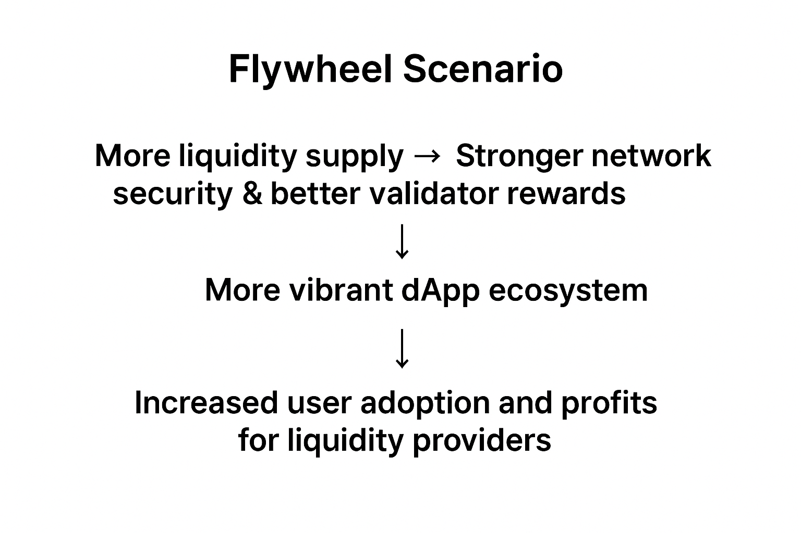

# PoL Security Guidelines: Tokenomics

<table><thead><tr><th width="595.53515625">Threat</th><th align="center">Impact</th></tr></thead><tbody><tr><td><a data-mention href="tokenomics.md#id-1-bgt">#id-1-bgt</a></td><td align="center"><code>High</code></td></tr><tr><td><a data-mention href="tokenomics.md#id-2-bgt">#id-2-bgt</a></td><td align="center"><code>Medium</code></td></tr><tr><td><a data-mention href="tokenomics.md#id-3-lsd-boost-bgt">#id-3-lsd-boost-bgt</a></td><td align="center"><code>Low</code></td></tr><tr><td><a data-mention href="tokenomics.md#id-4">#id-4</a></td><td align="center"><code>Low</code></td></tr><tr><td><a data-mention href="tokenomics.md#id-5-apr">#id-5-apr</a></td><td align="center"><code>Low</code></td></tr><tr><td><a data-mention href="tokenomics.md#id-6-claimfees">#id-6-claimfees</a></td><td align="center"><code>Low</code></td></tr></tbody></table>

### Threat 1: Liquidity crisis due to native token shortage during BGT redemption <a href="#id-1-bgt" id="id-1-bgt"></a>

If the target contract has an insufficient amount of native tokens during BGT redemption, some users will not be able to receive their rewards, and their reward claim transactions will be reverted, leading to a liquidity crisis.

#### Impact

`High`

If the redemptions of many users fail due to a shortage of native tokens, it can directly lead to a loss of trust, a large-scale capital outflow, and a system-wide liquidity crisis. Therefore, it is rated `High`.

#### Guideline

> * **Validation during BGT redemption:**
>   * Check contract balance:
>     * Use `safeTransferETH` in the `redeem` function to revert if the balance is insufficient when transferring BERA.
>   * Verify redemption request amount:
>     * Use the `checkUnboostedBalance` function to verify that the user's redemption request amount is less than or equal to the unboosted BGT amount.
> * **Ensure sufficient native token holdings in the contract:**
>   * Guarantee finality after redemption:
>     * After the redemption process is completed, use `_invariantCheck` to compare the current total BGT supply with the amount of native tokens held to verify that a sufficient amount of native tokens is held.
>   *   BERA issuance settings in the chain spec:
>
>       ```toml
>       # Deneb1 value changes
>       # Issue 5.75 BERA per block to the BGT token contract address
>       evm-inflation-address-deneb-one = "0x656b95E550C07a9ffe548bd4085c72418Ceb1dba"
>       evm-inflation-per-block-deneb-one = 5_750_000_000
>       ```
>   * **Manage excess token holdings and maintain an appropriate buffer:**
>     * When calculating the expected BGT issuance, calculate an accurate expected amount considering factors such as the block buffer size and BGT issuance per block.
>       * Calculate the maximum BGT that can be issued per block by inputting 100% for `boostPower` in the `computeReward` function of `BlockRewardController`.
>       * Set `HISTORY_BUFFER_LENGTH` to 8191 in accordance with EIP-4788.
>       * Calculate the potential BGT issuance with the above two values, then add it to the current BGT issuance to calculate `outstandingRequiredAmount`.
>       * If the native token balance exceeds the `outstandingRequiredAmount` value, burn the excess amount to the zero address through the `burnExceedingReserves` function.

#### Best Practice

[`BGT.sol`](https://github.com/wiimdy/bearmoon/blob/1e6bc4449420c44903d5bb7a0977f78d5e1d4dff/Core/src/pol/BGT.sol#L369)


```solidity
/// @inheritdoc IBGT
function redeem(
    address receiver,
    uint256 amount
)
    external
    invariantCheck
    checkUnboostedBalance(msg.sender, amount)
{
    /// Burn the BGT token from the msg.sender account and reduce the total supply.
    super._burn(msg.sender, amount);
    /// Transfer the Native token to the receiver.
    SafeTransferLib.safeTransferETH(receiver, amount);
    emit Redeem(msg.sender, receiver, amount);
}


function _checkUnboostedBalance(address sender, uint256 amount) private view {
    if (unboostedBalanceOf(sender) < amount) NotEnoughBalance.selector.revertWith();
}


function unboostedBalanceOf(address account) public view returns (uint256) {
    UserBoost storage userBoost = userBoosts[account];
    (uint128 boost, uint128 _queuedBoost) = (userBoost.boost, userBoost.queuedBoost);
    return balanceOf(account) - boost - _queuedBoost;
}

/// @inheritdoc IBGT
function burnExceedingReserves() external {
    IBlockRewardController br = IBlockRewardController(_blockRewardController);
    uint256 potentialMintableBGT = HISTORY_BUFFER_LENGTH * br.getMaxBGTPerBlock();
    uint256 currentReservesAmount = address(this).balance;
    uint256 outstandingRequiredAmount = totalSupply() + potentialMintableBGT;
    if (currentReservesAmount <= outstandingRequiredAmount) return;

    uint256 excessAmountToBurn = currentReservesAmount - outstandingRequiredAmount;
    SafeTransferLib.safeTransferETH(address(0), excessAmountToBurn);

    emit ExceedingReservesBurnt(msg.sender, excessAmountToBurn);
}

// Verify contract state consistency
modifier invariantCheck() {
    _;

    _invariantCheck();
}

function _invariantCheck() private view {
    if (address(this).balance < totalSupply()) InvariantCheckFailed.selector.revertWith();
}
```


[`BlockRewardController.sol`](https://github.com/wiimdy/bearmoon/blob/1e6bc4449420c44903d5bb7a0977f78d5e1d4dff/Core/src/pol/rewards/BlockRewardController.sol#L167-L210)


```solidity
/// @inheritdoc IBlockRewardController
function computeReward(
    uint256 boostPower,
    uint256 _rewardRate,
    uint256 _boostMultiplier,
    int256 _rewardConvexity
)
    public
    pure
    returns (uint256 reward)
{
    // On conv == 0, mathematical result should be max reward even for boost == 0 (0^0 = 1)
    // but since BlockRewardController enforces conv > 0, we're not adding code for conv == 0 case
    if (boostPower > 0) {
        // Compute intermediate parameters for the reward formula
        uint256 one = FixedPointMathLib.WAD;

        if (boostPower == one) {
            // avoid approx errors in the following code
            reward = FixedPointMathLib.mulWad(_rewardRate, _boostMultiplier);
        } else {
            // boost^conv ∈ (0, 1]
            uint256 tmp_0 = uint256(FixedPointMathLib.powWad(int256(boostPower), _rewardConvexity));
            // 1 + mul * boost^conv ∈ [1, 1 + mul]
            uint256 tmp_1 = one + FixedPointMathLib.mulWad(_boostMultiplier, tmp_0);
            // 1 - 1 / (1 + mul * boost^conv) ∈ [0, mul / (1 + mul)]
            uint256 tmp_2 = one - FixedPointMathLib.divWad(one, tmp_1);

            // @dev Due to splitting fixed point ops, [mul / (1 + mul)] * (1 + mul) may be slightly > mul
            uint256 coeff = FixedPointMathLib.mulWad(tmp_2, one + _boostMultiplier);
            if (coeff > _boostMultiplier) coeff = _boostMultiplier;

            reward = FixedPointMathLib.mulWad(_rewardRate, coeff);
        }
    }
}
// Amount of BGT issued when boostpower = 100%
/// @inheritdoc IBlockRewardController
function getMaxBGTPerBlock() public view returns (uint256 amount) {
    amount = computeReward(FixedPointMathLib.WAD, rewardRate, boostMultiplier, rewardConvexity);
    if (amount < minBoostedRewardRate) {
        amount = minBoostedRewardRate;
    }
    amount += baseRate;
}


```


***

### Threat 2: Operators collude to concentrate BGT rewards in a specific **reward vault**, leading to liquidity concentration and depletion of other protocols' liquidity <a href="#id-2-bgt" id="id-2-bgt"></a>

If operators collude to direct BGT rewards to a specific reward vault, the liquidity of some reward vaults will be depleted, and the liquidity of other protocols will also decrease.

#### Impact

`Medium`

If liquidity is concentrated in some vaults, it can lead to market distortion and service imbalances due to the depletion of liquidity in other vaults and protocols. However, since it does not directly lead to an immediate system-wide paralysis or catastrophic loss, it is rated `Medium`.

#### Guideline

> * **Force rewards to be distributed to multiple reward vaults to prevent concentration in a single vault.**
>   * Manage all created reward vault addresses (receivers) through the `Weight` struct.
>   * To receive rewards, a reward vault address (receiver) must be [registered in the whitelist through governance](../../reference.md#undefined-5)<sub>19</sub>.
>     * Simply being created in the `Weight` struct does not mean it can be allocated rewards.
> *   **Prevent an operator from concentrating rewards in a single vault through multiple transactions.**
>
>     <pre class="language-solidity"><code class="lang-solidity"><strong>/// @notice The delay in blocks before a new reward allocation can go into effect.
>     </strong>uint64 public rewardAllocationBlockDelay;
>     // Currently set to 2000 blocks (approx. 4000 seconds)
>
>     // function queueNewRewardAllocation
>     if (startBlock &#x3C;= block.number + rewardAllocationBlockDelay) {
>         InvalidStartBlock.selector.revertWith();
>     }
>     // function _validateWeights
>     if (totalWeight != ONE_HUNDRED_PERCENT) {
>             InvalidRewardAllocationWeights.selector.revertWith();
>         }
>     </code></pre>
>
>     * Introduce a delay (approx. 2000 blocks) for reward allocation so that it is not reflected immediately. Also, by requiring each allocation to distribute 100% of the total rewards, it prevents the distribution of rewards in parts through multiple transactions.
> * **If a single operator operates multiple validators, prevent them from concentrating the rewards of multiple validators in a specific vault.**
>   * **`queueNewRewardAllocation`**: Check the operator's total allocation limit.
>   * **`activateReadyQueuedRewardAllocation`**: Reflect the actual allocation and update the cumulative value.
>   * **`lastActiveWeights`**: Track the last activated `RewardAllocation` for each validator.
>   * **`operatorVaultAllocations`**: Track the total allocation ratio for each vault by operator.
>   * For detailed implementation, refer to the [Custom Code](tokenomics.md#undefined-4) below.
> * [**Prevent a situation where multiple operators collude to concentrate rewards in a specific vault**](../../reference.md#weight)<sub>**18**</sub>**.**
>   * If the total allocation of all operators to a specific vault exceeds a certain limit, introduce a function to temporarily suspend reward allocation to that vault (= the vault cannot be selected in `RewardAllocation`).
>   * Track the total allocation sum for each vault.
>   * If the limit is exceeded, the vault cannot be included in `RewardAllocation` (queuing itself will revert).
>   * Allocation can be resumed once it falls below the limit.
>   * For detailed implementation, refer to the [Custom Code](tokenomics.md#undefined-5) below.

#### Best Practice

[`BeraChef.sol`](https://github.com/wiimdy/bearmoon/blob/1e6bc4449420c44903d5bb7a0977f78d5e1d4dff/Core/src/pol/rewards/BeraChef.sol#L392-L394)


```solidity
/// @notice Mapping of receiver address to whether they are white-listed or not.
mapping(address receiver => bool) public isWhitelistedVault;

/// @dev Represents 100%. Chosen to be less granular.
uint96 internal constant ONE_HUNDRED_PERCENT = 1e4;
/// @notice The maximum weight a vault can assume in the reward allocation
uint96 public maxWeightPerVault;
// Currently set to 3000!!

// The RewardAllocation struct is composed of multiple Weights.
struct Weight {
    address receiver;           // RewardVault address
    uint96 percentageNumerator; // Reward percentage for the vault
}

/// @inheritdoc IBeraChef
function queueNewRewardAllocation(
    bytes calldata valPubkey,
    uint64 startBlock,
    Weight[] calldata weights
)
    external
    onlyOperator(valPubkey)
{
    // adds a delay before a new reward allocation can go into effect
    if (startBlock <= block.number + rewardAllocationBlockDelay) {
        InvalidStartBlock.selector.revertWith();
    }

    RewardAllocation storage qra = queuedRewardAllocations[valPubkey];

    // do not allow to queue a new reward allocation if there is already one queued
    if (qra.startBlock > 0) {
        RewardAllocationAlreadyQueued.selector.revertWith();
    }

    // validate if the weights are valid.
    _validateWeights(valPubkey, weights);

    // queue the new reward allocation
    qra.startBlock = startBlock;
    Weight[] storage storageWeights = qra.weights;
    for (uint256 i; i < weights.length;) {
        storageWeights.push(weights[i]);
        unchecked {
            ++i;
        }
    }
    emit QueueRewardAllocation(valPubkey, startBlock, weights);
}

function _validateWeights(bytes memory valPubkey, Weight[] calldata weights) internal {
    if (weights.length > maxNumWeightsPerRewardAllocation) {
        TooManyWeights.selector.revertWith();
    }
    _checkForDuplicateReceivers(valPubkey, weights);

    uint96 totalWeight;
    for (uint256 i; i < weights.length;) {
        Weight calldata weight = weights[i];

        if (weight.percentageNumerator == 0 || weight.percentageNumerator > maxWeightPerVault) {
            InvalidWeight.selector.revertWith();
        }

        // Original: Whitelist check
        if (!isWhitelistedVault[weight.receiver]) {
            NotWhitelistedVault.selector.revertWith();
        }

        // Incentive threshold check: all incentive token balances must be above the threshold
        address vault = weight.receiver;
        bool isSufficient = RewardVault(vault).getCurrentIncentiveBalance();
        if (!isSufficient) {
            // Vaults with insufficient incentives cannot be included in the reward allocation
            InvalidWeight.selector.revertWith();
        }

        totalWeight += weight.percentageNumerator;
        unchecked { ++i; }
    }
    if (totalWeight != ONE_HUNDRED_PERCENT) {
        InvalidRewardAllocationWeights.selector.revertWith();
    }
}

function _checkForDuplicateReceivers(bytes memory valPubkey, Weight[] calldata weights) internal {
    // use pubkey as identifier for the slot
    bytes32 slotIdentifier = keccak256(valPubkey);

    for (uint256 i; i < weights.length;) {
        address receiver = weights[i].receiver;
        bool duplicate;

        assembly ("memory-safe") {
            // Get free memory pointer
            let memPtr := mload(0x40)
            // Store receiver address at the first 32 bytes position
            mstore(memPtr, receiver)
            // Store slot identifier at the next 32 bytes position
            mstore(add(memPtr, 0x20), slotIdentifier)
            // Calculate storage key
            let storageKey := keccak256(memPtr, 0x40)
            // Check if receiver is already seen
            duplicate := tload(storageKey)
            if iszero(duplicate) { tstore(storageKey, 1) }
        }
        if (duplicate) {
            DuplicateReceiver.selector.revertWith(receiver);
        }
        unchecked {
            ++i;
        }
    }
}
```


`Custom Code`

<details>

<summary>Preventing a single operator running multiple validators from concentrating rewards in a specific vault</summary>


```solidity
// Total allocation ratio (cumulative) per operator per vault
mapping(address operator => mapping(address vault => uint96 totalAllocated)) public operatorVaultAllocations;

// Store weights of last activated RewardAllocation per validator (pubkey)
mapping(bytes valPubkey => Weight[]) internal lastActiveWeights;

function _validateOperatorTotalAllocation(
    address operator,
    Weight[] calldata newWeights,
    Weight[] storage oldWeights,
    uint96 maxTotalPerVault
) internal view {
    // Temporary mapping: cumulative sum per vault
    mapping(address => uint96) memory tempTotal;
    
    // Copy existing operatorVaultAllocations
    // (oldWeights are previous allocations for the validator, newWeights are new allocations to queue)
    // Subtract oldWeights from existing allocations, add newWeights
    
    // 1. Copy existing operatorVaultAllocations
    for (uint i = 0; i < newWeights.length; i++) {
        address vault = newWeights[i].receiver;
        tempTotal[vault] = operatorVaultAllocations[operator][vault];
    }
    for (uint i = 0; i < oldWeights.length; i++) {
        address vault = oldWeights[i].receiver;
        tempTotal[vault] = operatorVaultAllocations[operator][vault];
    }
    
    // 2. Subtract oldWeights
    for (uint i = 0; i < oldWeights.length; i++) {
        address vault = oldWeights[i].receiver;
        tempTotal[vault] -= oldWeights[i].percentageNumerator;
    }
    
    // 3. Add newWeights and check limits
    for (uint i = 0; i < newWeights.length; i++) {
        address vault = newWeights[i].receiver;
        tempTotal[vault] += newWeights[i].percentageNumerator;
        require(
            tempTotal[vault] <= maxTotalPerVault,
            "Too much allocation to one vault for this operator"
        );
    }
}

function _updateOperatorVaultAllocations(
    address operator,
    Weight[] storage oldWeights,
    Weight[] calldata newWeights
) internal {
    // Subtract oldWeights
    for (uint i = 0; i < oldWeights.length; i++) {
        address vault = oldWeights[i].receiver;
        operatorVaultAllocations[operator][vault] -= oldWeights[i].percentageNumerator;
    }
    
    // Add newWeights
    for (uint i = 0; i < newWeights.length; i++) {
        address vault = newWeights[i].receiver;
        operatorVaultAllocations[operator][vault] += newWeights[i].percentageNumerator;
    }
}

function queueNewRewardAllocation(
    bytes calldata valPubkey,
    uint64 startBlock,
    Weight[] calldata weights
) external onlyOperator(valPubkey) {
    // ... existing validation ...
    
    // 1. Extract operator address
    address operator = beaconDepositContract.getOperator(valPubkey);
    
    // 2. Previous activated RewardAllocation weights for the validator
    Weight[] storage oldWeights = lastActiveWeights[valPubkey];
    
    // 3. Check total allocation limit (e.g., 70% = 7000)
    _validateOperatorTotalAllocation(operator, weights, oldWeights, 7000);
    
    // ... existing queuing logic ...
}

function activateReadyQueuedRewardAllocation(bytes calldata valPubkey) external onlyDistributor {
    if (!isQueuedRewardAllocationReady(valPubkey, block.number)) return;
    
    RewardAllocation storage qra = queuedRewardAllocations[valPubkey];
    uint64 startBlock = qra.startBlock;
    
    // Extract operator address
    address operator = beaconDepositContract.getOperator(valPubkey);
    
    // Previous weights
    Weight[] storage oldWeights = lastActiveWeights[valPubkey];
    
    // Update operatorVaultAllocations
    _updateOperatorVaultAllocations(operator, oldWeights, qra.weights);
    
    // Update lastActiveWeights
    delete lastActiveWeights[valPubkey];
    for (uint i = 0; i < qra.weights.length; i++) {
        lastActiveWeights[valPubkey].push(qra.weights[i]);
    }
    
    activeRewardAllocations[valPubkey] = qra;
    emit ActivateRewardAllocation(valPubkey, startBlock, qra.weights);
    delete queuedRewardAllocations[valPubkey];
}
```


</details>

<details>

<summary>Preventing multiple operators from colluding to concentrate rewards in a specific vault</summary>


```solidity
// Total allocation sum per vault (sum of all operators)
mapping(address vault => uint96 totalAllocatedByAllOperators) public vaultTotalAllocations;

// Allocation limit per vault (e.g., 8000 = 80%, this amount can be modified through governance)
uint96 public constant VAULT_TOTAL_ALLOCATION_LIMIT = 8000;

function _validateVaultTotalAllocation(
    Weight[] calldata newWeights,
    Weight[] storage oldWeights
) internal view {
    // Temporary mapping: cumulative sum per vault
    mapping(address => uint96) memory tempTotal;
    
    // Copy existing vaultTotalAllocations
    for (uint i = 0; i < newWeights.length; i++) {
        address vault = newWeights[i].receiver;
        tempTotal[vault] = vaultTotalAllocations[vault];
    }
    for (uint i = 0; i < oldWeights.length; i++) {
        address vault = oldWeights[i].receiver;
        tempTotal[vault] = vaultTotalAllocations[vault];
    }
    
    // Subtract oldWeights
    for (uint i = 0; i < oldWeights.length; i++) {
        address vault = oldWeights[i].receiver;
        tempTotal[vault] -= oldWeights[i].percentageNumerator;
    }
    
    // Add newWeights and check limits
    for (uint i = 0; i < newWeights.length; i++) {
        address vault = newWeights[i].receiver;
        tempTotal[vault] += newWeights[i].percentageNumerator;
        require(
            tempTotal[vault] <= VAULT_TOTAL_ALLOCATION_LIMIT,
            "Vault allocation limit exceeded"
        );
    }
}

function queueNewRewardAllocation(
    bytes calldata valPubkey,
    uint64 startBlock,
    Weight[] calldata weights
) external onlyOperator(valPubkey) {
    // ... existing validation ...
    
    // Previous activated RewardAllocation weights for the validator
    Weight[] storage oldWeights = lastActiveWeights[valPubkey];
    
    // Check total allocation limit per vault
    _validateVaultTotalAllocation(weights, oldWeights);
    
    // ... existing queuing logic ...
}

function _updateVaultTotalAllocations(
    Weight[] storage oldWeights,
    Weight[] calldata newWeights
) internal {
    // Subtract oldWeights
    for (uint i = 0; i < oldWeights.length; i++) {
        address vault = oldWeights[i].receiver;
        vaultTotalAllocations[vault] -= oldWeights[i].percentageNumerator;
    }
    
    // Add newWeights
    for (uint i = 0; i < newWeights.length; i++) {
        address vault = newWeights[i].receiver;
        vaultTotalAllocations[vault] += newWeights[i].percentageNumerator;
    }
}

function activateReadyQueuedRewardAllocation(bytes calldata valPubkey) external onlyDistributor {
    if (!isQueuedRewardAllocationReady(valPubkey, block.number)) return;
    
    RewardAllocation storage qra = queuedRewardAllocations[valPubkey];
    uint64 startBlock = qra.startBlock;
    
    // Previous weights
    Weight[] storage oldWeights = lastActiveWeights[valPubkey];
    
    // Update total allocation sum per vault
    _updateVaultTotalAllocations(oldWeights, qra.weights);
    
    // ... existing logic ...
}
```


</details>

***

### Threat 3: Reward monopolization and BGT inflation due to boost collusion between LSD and validators <a href="#id-3-lsd-boost-bgt" id="id-3-lsd-boost-bgt"></a>

If a small number of top LSDs and validators collude to monopolize BGT boosting, BGT inflation could rapidly increase and BGT ownership and rewards could become concentrated among a very few entities.

#### Impact

`Low`

Although BGT inflation and reward concentration may favor a small number of entities, it does not directly cause critical immediate impact on overall system operation or stability, so it is rated `Low`.

#### Guideline

> * **Governance management of BlockRewardController reward parameters:**
>   * `baseRate`, `rewardRate`, `minBoostedRewardRate`, `boostMultiplier`, `rewardConvexity`, etc. → All can only be changed by onlyOwner (governance/operator) → Parameters can be immediately adjusted if inflation increases excessively
> * **Transparency and adjustability of reward distribution formulas**
>   * Reward formula
>     * BGT rewards are calculated with parameters like boostPower, rewardRate, boostMultiplier, rewardConvexity in the `computeReward()` function
> *   **Automatic detection and limitation when rewards become overly concentrated**
>
>     * When rewards become excessively concentrated in one validator/vault/address
>     * Adjust parameters like convexity, boostMultiplier in the reward distribution formula so that additional reward efficiency decreases rapidly as concentration increases
>     * computeReward() formula design
>
>     <figure><figcaption></figcaption></figure>
>
>     Source - https://docs.berachain.com/learn/pol/blockrewards
> * **Forced distribution in RewardAllocation**
>   * Distribution through Weight struct: When distributing rewards, clearly allocate ratios to multiple vaults (receivers) with Weight
>   * Limit maximum Weight per vault: Limit maximum Weight (maxWeightPerVault) allocatable to one vault
>   * Revert if RewardAllocation total is not 100%
>   *   Code reference: Check \_validateWeights code in Threat 2
>
>       ```solidity
>       if (weight.percentageNumerator == 0 || weight.percentageNumerator > maxWeightPerVault) {
>           InvalidWeight.selector.revertWith();
>       }
>       if (totalWeight != ONE_HUNDRED_PERCENT) {
>           InvalidRewardAllocationWeights.selector.revertWith();
>       }
>       ```
> * **Automatic revert when reward concentration limits are exceeded**
>   * Track total allocation sum per vault
>     * If total allocation sum of all operators to a specific vault exceeds the limit, the vault cannot be included in RewardAllocation (queuing itself will revert)
>   *   Code reference: See "Preventing multiple operators from colluding to concentrate rewards in a specific vault" section in Threat 2
>
>       ```solidity
>       require(vaultTotalAllocations[vault] + newWeight <= VAULT_TOTAL_ALLOCATION_LIMIT, "Vault allocation limit exceeded");
>       ```
> * **Real-time parameter adjustment and community monitoring**
>   * BlockRewardController parameters, RewardAllocation policies, etc. can only be changed by governance/operator
>   * Reference: Governance management of BlockRewardController reward parameters

#### Best Practice

`Custom Code`

<details>

<summary>Governance management of BlockRewardController reward parameters</summary>

```solidity
/// @inheritdoc IBlockRewardController
function setBaseRate(uint256 _baseRate) external onlyOwner {
    if (_baseRate > MAX_BASE_RATE) {
        InvalidBaseRate.selector.revertWith();
    }
    emit BaseRateChanged(baseRate, _baseRate);
    baseRate = _baseRate;
}

/// @inheritdoc IBlockRewardController
function setRewardRate(uint256 _rewardRate) external onlyOwner {
    if (_rewardRate > MAX_REWARD_RATE) {
        InvalidRewardRate.selector.revertWith();
    }
    emit RewardRateChanged(rewardRate, _rewardRate);
    rewardRate = _rewardRate;
}

/// @inheritdoc IBlockRewardController
function setMinBoostedRewardRate(uint256 _minBoostedRewardRate) external onlyOwner {
    if (_minBoostedRewardRate > MAX_MIN_BOOSTED_REWARD_RATE) {
        InvalidMinBoostedRewardRate.selector.revertWith();
    }
    emit MinBoostedRewardRateChanged(minBoostedRewardRate, _minBoostedRewardRate);
    minBoostedRewardRate = _minBoostedRewardRate;
}

/// @inheritdoc IBlockRewardController
function setBoostMultiplier(uint256 _boostMultiplier) external onlyOwner {
    if (_boostMultiplier > MAX_BOOST_MULTIPLIER) {
        InvalidBoostMultiplier.selector.revertWith();
    }
    emit BoostMultiplierChanged(boostMultiplier, _boostMultiplier);
    boostMultiplier = _boostMultiplier;
}

/// @inheritdoc IBlockRewardController
function setRewardConvexity(uint256 _rewardConvexity) external onlyOwner {
    if (_rewardConvexity == 0 || _rewardConvexity > MAX_REWARD_CONVEXITY) {
        InvalidRewardConvexity.selector.revertWith();
    }
    emit RewardConvexityChanged(uint256(rewardConvexity), _rewardConvexity);
    // store as int256 to avoid casting during computation
    rewardConvexity = int256(_rewardConvexity);
}
```

</details>

<details>

<summary>Reward distribution formula example</summary>

```solidity
/// @inheritdoc IBlockRewardController
function computeReward(
    uint256 boostPower,
    uint256 _rewardRate,
    uint256 _boostMultiplier,
    int256 _rewardConvexity
)
    public
    pure
    returns (uint256 reward)
{
    // On conv == 0, mathematical result should be max reward even for boost == 0 (0^0 = 1)
    // but since BlockRewardController enforces conv > 0, we're not adding code for conv == 0 case
    if (boostPower > 0) {
        // Compute intermediate parameters for the reward formula
        uint256 one = FixedPointMathLib.WAD;

        if (boostPower == one) {
            // avoid approx errors in the following code
            reward = FixedPointMathLib.mulWad(_rewardRate, _boostMultiplier);
        } else {
            // boost^conv ∈ (0, 1]
            uint256 tmp_0 = uint256(FixedPointMathLib.powWad(int256(boostPower), _rewardConvexity));
            // 1 + mul * boost^conv ∈ [1, 1 + mul]
            uint256 tmp_1 = one + FixedPointMathLib.mulWad(_boostMultiplier, tmp_0);
            // 1 - 1 / (1 + mul * boost^conv) ∈ [0, mul / (1 + mul)]
            uint256 tmp_2 = one - FixedPointMathLib.divWad(one, tmp_1);

            // @dev Due to splitting fixed point ops, [mul / (1 + mul)] * (1 + mul) may be slightly > mul
            uint256 coeff = FixedPointMathLib.mulWad(tmp_2, one + _boostMultiplier);
            if (coeff > _boostMultiplier) coeff = _boostMultiplier;

            reward = FixedPointMathLib.mulWad(_rewardRate, coeff);
        }
    }
}
```

</details>


```solidity
// Prevent circular boosting during BGT delegation
mapping(address => mapping(address => uint256)) public vaultOriginBGT;
mapping(address => uint256) public lastVaultRewardTime;

function delegateBGT(address validator, uint256 amount) external {
    // 30-day cooldown check
    require(block.timestamp > lastVaultRewardTime[msg.sender] + 30 days, "Cooldown period");
    
    // Prohibit self-boosting
    address targetVault = validatorToVault[validator];
    require(vaultOriginBGT[msg.sender][targetVault] == 0, "No self-boosting");
    
    // Force distributed delegation (max 20%)
    uint256 totalBGT = bgtToken.balanceOf(msg.sender);
    require(delegatedAmount[msg.sender][validator] + amount <= totalBGT * 20 / 100, "Max 20% per validator");
    
    _delegate(validator, amount);
}

// Inflation control
function checkInflationLimit() external view returns (bool) {
    uint256 weeklyInflation = calculateWeeklyInflation();
    uint256 targetWeekly = TARGET_ANNUAL_INFLATION / 52; // 10% / 52 weeks
    
    return weeklyInflation <= targetWeekly * 130 / 100; // 30% buffer
}
```


***

### Threat 4: Validator boost reward reduction if additional supply is not provided after incentive tokens are depleted <a href="#id-4" id="id-4"></a>

If additional supply is not provided after incentive tokens are depleted, validators' boost rewards will drastically decrease. If the incentive token balance in reward vaults cannot be checked in real-time, validators may not be able to anticipate reward reductions in advance.

#### Impact

`Low`

When incentive tokens are depleted, validator rewards may temporarily decrease, but this does not directly cause critical impact on overall system stability or operation and can be relatively easily recovered through additional supply, so it is rated `Low`.

#### Guideline

> * **Limit minimum incentive token holdings in reward vaults**
>   * Add `minIncentiveBalance` state variable
>   * Changeable via setter
>   * Add event logging
>   * Add `getCurrentIncentiveBalance()` function to check current incentive token balance in reward vaults
> * **For validators, when selecting reward vaults to distribute BGT, allocation to reward vaults with incentive tokens below the threshold is not allowed**
>   * In `_validateWeights` and `_checkIfStillValid` functions, if each vault's incentive balance is below threshold, it cannot be included in reward allocation (revert)
>   * `guaranteeBlocks` is set to unify with `rewardAllocationBlockDelay` currently set to 2000 blocks in `BeraChef`
> * **`minIncentiveBalance` is calculated by multiplying the most recent BGT issuance by each incentive token's `incentiveRate` and reward allocation period (`guaranteeBlocks`) to get the incentive amount for BGT issued per period**
> * **Through `getCurrentIncentiveBalance`, check if all incentive tokens have quantity above `minIncentiveBalance` when allocating rewards; if insufficient, allocation is not possible**

#### Best Practice

`Custom Code`


```solidity
contract RewardVault {
    // ... (existing state variables and code omitted) ...

    // Minimum incentive balance per token
    mapping(address => uint256) public minIncentiveBalance;

    uint256 public guaranteeBlocks = 2000; // Currently validator reward allocation delay is 2000 blocks
    

    // ... (existing code omitted) ...
    
    /// @notice Change minimum incentive guarantee block count (onlyFactoryOwner)
    function setGuaranteeBlocks(uint256 _guaranteeBlocks) external onlyFactoryOwner {
        require(_guaranteeBlocks > 0, "RewardVault: guaranteeBlocks must be positive");
        guaranteeBlocks = _guaranteeBlocks;
    }

    /// @dev Update minimum incentive balance per token based on BGT issuance and incentiveRate
    function _updateMinIncentiveBalance(address token, uint256 bgtEmitted) internal {
        uint256 incentiveRate = incentives[token].incentiveRate;
        // Expected payout for 2000 blocks = bgtEmitted(this distribution amount) * 2000 / 1 (with PRECISION applied)
        minIncentiveBalance[token] = bgtEmitted * GUARANTEE_BLOCKS * incentiveRate / FixedPointMathLib.PRECISION;
    }

    /// @dev Update minimum balance with each incentive distribution
    function _processIncentives(bytes calldata pubkey, uint256 bgtEmitted) internal {
        // ... existing code ...
        uint256 whitelistedTokensCount = whitelistedTokens.length;
        for (uint256 i; i < whitelistedTokensCount; ++i) {
            address token = whitelistedTokens[i];
            Incentive storage incentive = incentives[token];
            // ... existing distribution logic ...
            // Update minimum balance after distribution
            _updateMinIncentiveBalance(token, bgtEmitted);
        }
    }

    /// @notice Check if balance of all incentive tokens is above minimum balance for each token
    function getCurrentIncentiveBalance() external view returns (bool) {
        uint256 len = whitelistedTokens.length;
        for (uint256 i = 0; i < len; ++i) {
            address token = whitelistedTokens[i];
            if (incentives[token].amountRemaining < minIncentiveBalance[token]) {
                return false; // Return false if even one is insufficient
            }
        }
        return true; // Return true if all are sufficient
    }

    // ... (rest of existing code) ...
}
```


```solidity
function _validateWeights(bytes memory valPubkey, Weight[] calldata weights) internal {
    if (weights.length > maxNumWeightsPerRewardAllocation) {
        TooManyWeights.selector.revertWith();
    }
    _checkForDuplicateReceivers(valPubkey, weights);

    uint96 totalWeight;
    for (uint256 i; i < weights.length;) {
        Weight calldata weight = weights[i];

        if (weight.percentageNumerator == 0 || weight.percentageNumerator > maxWeightPerVault) {
            InvalidWeight.selector.revertWith();
        }

        // Existing: Whitelist check
        if (!isWhitelistedVault[weight.receiver]) {
            NotWhitelistedVault.selector.revertWith();
        }

        // Incentive threshold check: all incentive token balances must be above threshold
        address vault = weight.receiver;
        bool isSufficient = RewardVault(vault).getCurrentIncentiveBalance();
        if (!isSufficient) {
            // Vaults with insufficient incentives cannot be included in reward allocation
            InvalidWeight.selector.revertWith();
        }

        totalWeight += weight.percentageNumerator;
        unchecked { ++i; }
    }
    if (totalWeight != ONE_HUNDRED_PERCENT) {
        InvalidRewardAllocationWeights.selector.revertWith();
    }
}

function _checkIfStillValid(Weight[] memory weights) internal view returns (bool) {
    uint256 length = weights.length;
    if (length > maxNumWeightsPerRewardAllocation) {
        return false;
    }
    for (uint256 i; i < length;) {
        address vault = weights[i].receiver;
        if (weights[i].percentageNumerator > maxWeightPerVault) {
            return false;
        }
        if (!isWhitelistedVault[vault]) {
            return false;
        }
        // Incentive threshold check: all incentive token balances must be above threshold
        bool isSufficient = RewardVault(vault).getCurrentIncentiveBalance();
        if (!isSufficient) {
            return false;
        }
        unchecked { ++i; }
    }
    return true;
}
```

***

### Threat 5: Boost APR reduction for validators who selected the corresponding reward vault due to lowered reward ratios after incentive tokens are depleted <a href="#id-5-apr" id="id-5-apr"></a>

After incentive tokens are depleted, incentive ratios are lowered, causing boost APR reduction for validators who selected the corresponding reward vaults. If authority management is inadequate, incentive ratios could be arbitrarily adjusted, causing damage.

#### Impact

`Low`

Although incentive ratio adjustments may reduce boost APR for some validators, this is limited and temporary loss that does not significantly affect overall system stability or operation, so it is rated `Low`.

#### Guideline

> * **Define clear roles (Owner, Admin, User, etc.) for each function and critical data, strictly grant access permissions according to roles**
>   * Owner: Contract settings, incentive token management, administrator designation, pause/resume, recovery of incorrect tokens, etc.
>   * Admin: Incentive addition/settlement (token-specific manager), reward period settings (RewardDurationManager)
>   * User: Staking/unstaking, reward claiming, delegation, operator designation (only their own operator), etc.
> * **Clearly use modifiers like onlyOwner, onlyRole**
> * **Event logging for administrative activities (permission changes, critical function calls, etc.)**

#### Best Practice

[`RewardVault.sol`](https://github.com/wiimdy/bearmoon/blob/1e6bc4449420c44903d5bb7a0977f78d5e1d4dff/Core/src/pol/rewards/RewardVault.sol#L373)


```javascript
function addIncentive(
    address token,
    uint256 amount,
    uint256 incentiveRate
)
    external
    nonReentrant
    onlyWhitelistedToken(token)
{
    // ...
    // Reward ratio changes are only possible with manager permission
    if (msg.sender != manager) NotIncentiveManager.selector.revertWith();
    // ...
}

function getReward(
    address account,
    address recipient
)
    external
    nonReentrant
    // Reward claiming is only executable by operator or users set by operator
    onlyOperatorOrUser(account)
    returns (uint256)
{
    // ...
}
```


***

### Threat 6: Distortion of user fee rewards due to front-running of claimFees function <a href="#id-6-claimfees" id="id-6-claimfees"></a>

When front-running occurs through transaction preemption before users calling the claimFees function, users may suffer losses by having to pay HONEY without receiving fee rewards.

#### Impact

`Low`

Although claimFees front-running may temporarily distort fee rewards for some users, this occurs limitedly to individual users and does not significantly affect overall system stability or operation, so it is rated `Low`.

#### Guideline

> * **Before claiming fees, compare the balance state of fees that serve as calculation basis with users' expected rewards, and revert if actual claimable fees are less**
>   * Previously, claiming only required passing an array of desired fee token addresses as arguments
>   * Additionally, create arrays of expected amounts for each fee token and pass as arguments, reverting if the contract's current fee token amount is below expectations

#### Best Practice

`Custom Code`


```solidity
function claimFees(
    address _recipient,
    address[] calldata _feeTokens,
    uint256[] calldata _expectedAmounts
) external whenNotPaused {
    // Check if _feeTokens and _expectedAmounts arrays have matching length (input validation)
    require(_feeTokens.length == _expectedAmounts.length, "FeeCollector: Length mismatch");

    // Transfer payoutToken from msg.sender to rewardReceiver (token movement for fee payment)
    IERC20(payoutToken).safeTransferFrom(msg.sender, rewardReceiver, payoutAmount);

    // Notify rewardReceiver (BGTStaker contract) of reward payment
    BGTStaker(rewardReceiver).notifyRewardAmount(payoutAmount);

    // Transfer fees to _recipient for each feeToken
    for (uint256 i; i < _feeTokens.length;) {
        address feeToken = _feeTokens[i];
        uint256 expectedAmount = _expectedAmounts[i];

        // Check current contract's feeToken balance
        uint256 feeTokenAmountToTransfer = IERC20(feeToken).balanceOf(address(this));

        // Verify if balance exists above expected fee amount
        require(feeTokenAmountToTransfer >= expectedAmount, "FeeCollector: Insufficient fee token amount");

        // Transfer feeToken to _recipient
        IERC20(feeToken).safeTransfer(_recipient, feeTokenAmountToTransfer);

        // Emit fee claim event
        emit FeesClaimed(msg.sender, _recipient, feeToken, feeTokenAmountToTransfer);

        unchecked { ++i; }
    }

    // Emit overall fee claim event
    emit FeesClaimed(msg.sender, _recipient);

    // Reset payoutAmount if queuedPayoutAmount remains
    if (queuedPayoutAmount != 0) _setPayoutAmount();
}
```

