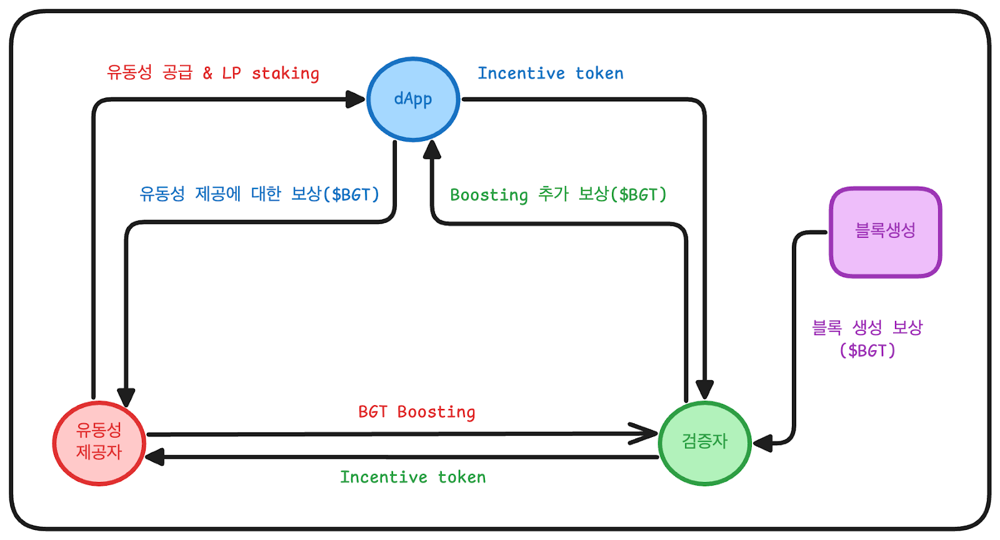

# Berachain PoL 개요

**PoL(Proof of Liquidity)**&#xC740; 기존 PoS(Proof of Stake)과 달리 생태계에 실질적 유동성을 공급하는 새로운 메커니즘입니다.

PoS의 경우에는 네이티브 토큰을 스테이킹함으로써 보상을 얻는 구조입니다.\
반면 PoL에서는 사용자가 단순히 보유하는 것을 넘어서 베라체인 생태계(DEX, Lending Protocol)에 유동성을 공급하여 얻은 BGT를 스테이킹하여 네트워크에 기여합니다.

PoS가 ‘자산 보유 = 기여’라는 가정에 기반했다면, PoL은 ‘실사용 기반 자산 = 진짜 기여’라는 가정을 기반으로 네트워크 보안성과 DeFi 생태계 활성화를 동시에 달성하는 것을 목표로 합니다.

즉, 핵심은 네트워크 보안에 기여하면서도 생태계에 직접 참여할 수 있다는 것입니다.

|    특성    |    PoS   |         PoL         |
| :------: | :------: | :-----------------: |
|  네트워크 참여 |  단순 스테이킹 |   유동성 공급 + LP 스테이킹  |
|  경제적 모델  | 단일 토큰 모델 | 이중 토큰 모델 (BERA/BGT) |
| 네트워크 활성화 |  간접적 기여  |        직접적 기여       |

베라체인의 PoL은 아래와 같은 **삼중 토큰 모델**로 설계되어 있습니다.

1. **BERA**: 베라체인의 네이티브 토큰으로, 트랜잭션 수수료 지불, 유동성 제공 및 네트워크 보안 유지에 사용됩니다.
2. **BGT(Berachain Governance Token)**: 베라체인의 거버넌스 및 보상 토큰으로, 주로 생태계에 유동성을 제공한 참여자들에게 리워드 볼트를 통해 분배되며 validator 또한 블록 제안 시 기본 보상으로 BGT를 받습니다. 이 토큰은 non-transfer 특성을 가져 사용자에게 귀속되며, validator 부스팅(위임) 및 거버넌스 투표에 활용됩니다. 또한, $BERA로 1:1 교환이 가능합니다.
3. **HONEY**: 베라체인의 스테이블 코인으로, dApp 생태계 내 대출, 거래등 다양한 금융 활동의 기본 단위로 사용됩니다. 스테이블 코인(USDC, \*BYUSD)을 담보로 생성되며 프로토콜 내 담보비율과 오라클 가격을 기반으로 안정성을 유지합니다.

이러한 삼중 토큰 구조를 통해서 베라체인은 **“생태계 참여 = 보상 = 거버넌스”** 라는 경제적 플라이휠 구조를 가능하게 합니다.

_\*BYUSD: 페이팔 USD(PYUSD)를 베라체인으로 브릿지해서 전송한 토큰_

***

### 베라체인 플라이휠 

베라체인은 PoL을 기반으로 네트워크 참여자(프로토콜, 검증자, 유동성 공급자) 간의 보상을 하나의 구조로 연결하여 장기적 건전성을 목표로 **플라이휠**을 설계했습니다.

이 구조에서 검증자 간 boost 경쟁, 유동성 공급자 간 수익 최적화 전략, 각 dApp 프로토콜 간 유동성 유치 경쟁이 유도되어 결과적으로 생태계 전체의 유동성과 보안성이 함께 성장해나가는 선순환 구조로 이어집니다. \
즉, PoL 구조에서 단순한 보상 분배가 아니라 네트워크 참여자간 전략적 경쟁을 통해서 생태계 성장의 원동력을 만드는 시스템으로 동작합니다.

구체적인 플라이휠은 각 참여자 별로 다음과 같이 동작합니다.

1. **유동성 공급자** → 유동성 제공 → LP 토큰 스테이킹 → BGT 보상 → 검증자 부스트
2. **검증자** → BERA 스테이킹 → 블록생성(블록 생성 보상) → 보상 금고에 보상 분배 → 인센티브 토큰 보상
3. **프로토콜(dApp)** → 유동성 제공 받음 → 인센티브 토큰 제공

<figure><figcaption></figcaption></figure>

결과적으로 플라이휠이 정상적으로 동작할 때 다음과 같은 선순환 구조를 형성합니다.

<figure><figcaption></figcaption></figure>

이는 결과적으로 베라체인 네트워크 전체의 **성장과 안정성**을 촉진합니다.

***

베라체인의 PoL은 네트워크 보안과 유동성을 동시에 충족시키는 구조로서 실사용 기반 참여를 유도하여 생태계가 활성화될 수 있도록 합니다. 또한 거버넌스 토큰인 BGT는 실질적인 생태계 참여자들에게만 분배되어 실제 네트워크 참여자가 거버넌스 참여자가 될 수 있도록 합니다.

하지만, PoL은 완전하진 않습니다.

정상적인 플라이휠이 돈다면 모두에게 이득이 되는 구조로 이어지지만 유동성 기반 합의 알고리즘인 만큼 유동성이 줄어들어 **역플라이휠**이 돈다면 생태계 전체가 불안정해질 수 있다는 단점이 존재합니다.

<figure><figcaption></figcaption></figure>

또한 PoL에는 유동성 집중, BGT 독점, 중앙화 리스크 등의 문제도 존재합니다.

이러한 불완전성을 해결하기 위해서는 생태계 전반에서 보안 중심의 설계 원칙이 반드시 적용되어야 합니다.

이러한 배경속에서 **PoL 보안 가이드라인**을 제안합니다.
