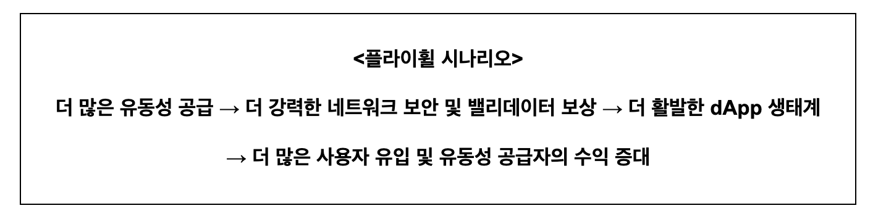

# PoL 보안 가이드라인: 토크노믹스

<table><thead><tr><th width="595.53515625">위협</th><th align="center">영향도</th></tr></thead><tbody><tr><td><a data-mention href="tokenomics.md#id-1-bgt">#id-1-bgt</a></td><td align="center"><code>High</code></td></tr><tr><td><a data-mention href="tokenomics.md#id-2-bgt">#id-2-bgt</a></td><td align="center"><code>Medium</code></td></tr><tr><td><a data-mention href="tokenomics.md#id-3-boost-bgt">#id-3-boost-bgt</a></td><td align="center"><code>Low</code></td></tr><tr><td><a data-mention href="tokenomics.md#id-4">#id-4</a></td><td align="center"><code>Low</code></td></tr><tr><td><a data-mention href="tokenomics.md#id-5-apr">#id-5-apr</a></td><td align="center"><code>Low</code></td></tr><tr><td><a data-mention href="tokenomics.md#id-6-claimfees">#id-6-claimfees</a></td><td align="center"><code>Low</code></td></tr></tbody></table>

### 위협 1: BGT 리딤 시 네이티브 토큰 부족으로 인한 유동성 위기

BGT 리딤 시 대상 컨트랙트가 현재 보유하고 있는 네이티브 토큰의 수량이 부족할 경우 일부 사용자는 보상을 받지 못하고 보상 수령 트랜잭션이 revert 되어 유동성 위기가 발생한다.

#### 영향도

`High`

네이티브 토큰 부족으로 인해 다수 사용자의 리딤이 실패하면 신뢰도 하락과 대규모 자금 이탈, 시스템 전반의 유동성 위기로 직결될 수 있기 때문에 `High` 로 평가한다.

#### 가이드라인

> * **BGT 리딤 시 유효성 검증**
>   * 컨트랙트 잔액 확인
>     * redeem 함수에서 BERA transfer시 safeTransferETH사용하여 잔액 부족 시 revert
>   * 리딤 요청량 검증
>     * checkUnboostedBalance 함수를 이용하여 사용자의 리딤 요청량이 unboost한 BGT 수량보다 적거나 같은지 검증
> * **컨트랙트 내 충분한 네이티브 토큰 보유량 확보**
>   * 리딤 이후 최종성 보장
>     * \_invariantCheck를 통해 리딤 과정이 종료된 뒤 현재 BGT 총 발행량과 보유 네이티브 토큰 수량을 비교하여 충분한 양의 네이티브 토큰을 보유하고 있는지 검증
>   *   체인 스펙 상 BERA발행 설정
>
>       ```toml
>       # Deneb1 value changes
>       # BGT 토큰 컨트랙트 주소로 블록당 5.75 BERA 발행
>       evm-inflation-address-deneb-one = "0x656b95E550C07a9ffe548bd4085c72418Ceb1dba"
>       evm-inflation-per-block-deneb-one = 5_750_000_000
>       ```
> * **초과 토큰 보유량 관리 및 적절한 버퍼 유지**
>   * BGT 예상 발행량 계산 시 블록 버퍼 크기와 블록당 BGT 발행량 등 고려한 정확한 예상량 산출
>     * BlockRewardController의 computeReward 함수에 boostPower로 100%를 입력하여 한 블록당 나올 수 있는 BGT 최대치를 계산
>     * EIP-4788에 맞게 HISTORY\_BUFFER\_LENGTH를 8191로 설정
>     * 위의 두 값으로 잠재적 BGT 발행량을 계산한 뒤, 현재 BGT 발행량에 더해 outstandingRequiredAmount를 계산
>     * 네이티브 토큰 잔액이 outstandingRequiredAmount값을 넘으면 burnExceedingReserves 함수를 통해 초과한 양 만큼 zero address로 소각

#### Best Practice&#x20;

&#x20;[`BGT.sol`](https://github.com/wiimdy/bearmoon/blob/1e6bc4449420c44903d5bb7a0977f78d5e1d4dff/Core/src/pol/BGT.sol#L369)

```solidity
/// @inheritdoc IBGT
function redeem(
    address receiver,
    uint256 amount
)
    external
    invariantCheck
    checkUnboostedBalance(msg.sender, amount)
{
    /// Burn the BGT token from the msg.sender account and reduce the total supply.
    super._burn(msg.sender, amount);
    /// Transfer the Native token to the receiver.
    SafeTransferLib.safeTransferETH(receiver, amount);
    emit Redeem(msg.sender, receiver, amount);
}


function _checkUnboostedBalance(address sender, uint256 amount) private view {
    if (unboostedBalanceOf(sender) < amount) NotEnoughBalance.selector.revertWith();
}


function unboostedBalanceOf(address account) public view returns (uint256) {
    UserBoost storage userBoost = userBoosts[account];
    (uint128 boost, uint128 _queuedBoost) = (userBoost.boost, userBoost.queuedBoost);
    return balanceOf(account) - boost - _queuedBoost;
}

/// @inheritdoc IBGT
function burnExceedingReserves() external {
    IBlockRewardController br = IBlockRewardController(_blockRewardController);
    uint256 potentialMintableBGT = HISTORY_BUFFER_LENGTH * br.getMaxBGTPerBlock();
    uint256 currentReservesAmount = address(this).balance;
    uint256 outstandingRequiredAmount = totalSupply() + potentialMintableBGT;
    if (currentReservesAmount <= outstandingRequiredAmount) return;

    uint256 excessAmountToBurn = currentReservesAmount - outstandingRequiredAmount;
    SafeTransferLib.safeTransferETH(address(0), excessAmountToBurn);

    emit ExceedingReservesBurnt(msg.sender, excessAmountToBurn);
}

// 컨트랙트 상태 일관성 검증
modifier invariantCheck() {
    _;

    _invariantCheck();
}

function _invariantCheck() private view {
    if (address(this).balance < totalSupply()) InvariantCheckFailed.selector.revertWith();
}
```

[`BlockRewardController.sol`](https://github.com/wiimdy/bearmoon/blob/1e6bc4449420c44903d5bb7a0977f78d5e1d4dff/Core/src/pol/rewards/BlockRewardController.sol#L167-L210)

```solidity
/// @inheritdoc IBlockRewardController
function computeReward(
    uint256 boostPower,
    uint256 _rewardRate,
    uint256 _boostMultiplier,
    int256 _rewardConvexity
)
    public
    pure
    returns (uint256 reward)
{
    // On conv == 0, mathematical result should be max reward even for boost == 0 (0^0 = 1)
    // but since BlockRewardController enforces conv > 0, we're not adding code for conv == 0 case
    if (boostPower > 0) {
        // Compute intermediate parameters for the reward formula
        uint256 one = FixedPointMathLib.WAD;

        if (boostPower == one) {
            // avoid approx errors in the following code
            reward = FixedPointMathLib.mulWad(_rewardRate, _boostMultiplier);
        } else {
            // boost^conv ∈ (0, 1]
            uint256 tmp_0 = uint256(FixedPointMathLib.powWad(int256(boostPower), _rewardConvexity));
            // 1 + mul * boost^conv ∈ [1, 1 + mul]
            uint256 tmp_1 = one + FixedPointMathLib.mulWad(_boostMultiplier, tmp_0);
            // 1 - 1 / (1 + mul * boost^conv) ∈ [0, mul / (1 + mul)]
            uint256 tmp_2 = one - FixedPointMathLib.divWad(one, tmp_1);

            // @dev Due to splitting fixed point ops, [mul / (1 + mul)] * (1 + mul) may be slightly > mul
            uint256 coeff = FixedPointMathLib.mulWad(tmp_2, one + _boostMultiplier);
            if (coeff > _boostMultiplier) coeff = _boostMultiplier;

            reward = FixedPointMathLib.mulWad(_rewardRate, coeff);
        }
    }
}
// boostpower = 100%일 경우 발행되는 BGT양
/// @inheritdoc IBlockRewardController
function getMaxBGTPerBlock() public view returns (uint256 amount) {
    amount = computeReward(FixedPointMathLib.WAD, rewardRate, boostMultiplier, rewardConvexity);
    if (amount < minBoostedRewardRate) {
        amount = minBoostedRewardRate;
    }
    amount += baseRate;
}


```

***

### 위협 2: 운영자들이 담합하여 특정 **보상 금고**에만 BGT 보상을 집중, 유동성 쏠림 및 타 프로토콜 유동성 고갈

운영자들이 담합하여 특정 보상 금고에만 BGT 보상을 몰아주면, 일부 보상 금고의 유동성이 고갈되고 타 프로토콜의 유동성도 줄어든다.

#### 영향도

`Medium`

일부 금고에 유동성이 집중되면 타 금고 및 프로토콜의 유동성 고갈로 시장 왜곡과 서비스 불균형이 발생할 수 있지만, 전체 시스템의 즉각적인 마비나 치명적 손실로 직결되지는 않기 때문에 `Medium` 으로 평가한다.

#### 가이드라인

> * **하나의 보상 금고에 보상 집중할 수 없게 여러 보상 금고에게 나눠 주도록 강제**
>   * Weight 구조체를 통해 생성되어 있는 모든 보상 금고 주소(receiver) 관리
>   * 보상 금고 주소(receiver)로 보상을 받기 위해서는 [거버넌스를 통해 whitelist에 등록](../../reference.md#iswhitelistedvault-_checkforduplicatereceivers-100)되어야함
>     * 단순 Weight 구조체로 생성되었다고 보상을 할당 받을 수 있는것이 아님\
>
> *   **하나의 운영자가 여러 트랜잭션으로 하나의 금고에 보상을 할당해 보상을 집중 시키는 것을 방지**
>
>     ```solidity
>     /// @notice The delay in blocks before a new reward allocation can go into effect.
>     uint64 public rewardAllocationBlockDelay;
>     // 현재 2000 블록으로 설정 (약 4000초)
>
>     // function queueNewRewardAllocation
>     if (startBlock <= block.number + rewardAllocationBlockDelay) {
>         InvalidStartBlock.selector.revertWith();
>     }
>     // function _validateWeights
>     if (totalWeight != ONE_HUNDRED_PERCENT) {
>             InvalidRewardAllocationWeights.selector.revertWith();
>         }
>     ```
>
>     * 보상 할당에 딜레이(약 2000블록)을 두어 보상 할당이 바로 반영되지 않도록 하고 각 할당마다 전체 보상의 100%를 모두 분배하도록 하여서 여러 트랜잭션을 이용해 보상을 나눠 분배하는 것을 방지\
>
> * **하나의 운영자가 여러 검증자를 운영할 경우, 그를 통해 여러 검증자의 보상을 특정 금고에 집중하는 것을 방지**
>   * **queueNewRewardAllocation**: operator 전체 할당 한도 체크
>   * **activateReadyQueuedRewardAllocation**: 실제 할당 반영 및 누적값 갱신
>   * **lastActiveWeights**: validator별 마지막 활성화된 RewardAllocation 추적
>   * **operatorVaultAllocations**: operator별 vault별 전체 할당 비율 추적
>   * 자세한 구현사항은 아래 [커스텀 코드](tokenomics.md#undefined-4) 참고\
>
> * [**여러 운영자가 담합을 통해 특정 금고에 보상을 집중하는 상황 방지**](../../reference.md#id-18-weight-receiver-percentagenumerator-maxweightpervault-3000-30)
>   *   모든 운영자들이 특정 금고에 할당한 전체 합계가 일정 한도를 초과하면,
>
>       해당 금고에 대한 보상 할당을 일시적으로 중단(=RewardAllocation에서 해당 vault를 선택 불가)하는 기능 도입
>   * vault별 전체 할당 합계를 추적
>   * 한도 초과 시, 해당 vault는 RewardAllocation에 포함 불가(큐잉 자체가 revert)
>   * 한도 미만이 되면 다시 할당 가능
>   * 자세한 구현사항은 아래 [커스텀 코드](tokenomics.md#undefined-5) 참고

#### Best Practice&#x20;

&#x20;[`BeraChef.sol`](https://github.com/wiimdy/bearmoon/blob/1e6bc4449420c44903d5bb7a0977f78d5e1d4dff/Core/src/pol/rewards/BeraChef.sol#L392-L394)

```solidity
/// @notice Mapping of receiver address to whether they are white-listed or not.
mapping(address receiver => bool) public isWhitelistedVault;

/// @dev Represents 100%. Chosen to be less granular.
uint96 internal constant ONE_HUNDRED_PERCENT = 1e4;
/// @notice The maximum weight a vault can assume in the reward allocation
uint96 public maxWeightPerVault;
// 현재 3000으로 설정되어있음!!

// RewardAllocation 구조체는 여러 개의 Weight로 구성
struct Weight {
    address receiver;           // 보상 금고(RewardVault) 주소
    uint96 percentageNumerator; // 해당 금고가 받을 보상 비율
}

/// @inheritdoc IBeraChef
function queueNewRewardAllocation(
    bytes calldata valPubkey,
    uint64 startBlock,
    Weight[] calldata weights
)
    external
    onlyOperator(valPubkey)
{
    // adds a delay before a new reward allocation can go into effect
    if (startBlock <= block.number + rewardAllocationBlockDelay) {
        InvalidStartBlock.selector.revertWith();
    }

    RewardAllocation storage qra = queuedRewardAllocations[valPubkey];

    // do not allow to queue a new reward allocation if there is already one queued
    if (qra.startBlock > 0) {
        RewardAllocationAlreadyQueued.selector.revertWith();
    }

    // validate if the weights are valid.
    _validateWeights(valPubkey, weights);

    // queue the new reward allocation
    qra.startBlock = startBlock;
    Weight[] storage storageWeights = qra.weights;
    for (uint256 i; i < weights.length;) {
        storageWeights.push(weights[i]);
        unchecked {
            ++i;
        }
    }
    emit QueueRewardAllocation(valPubkey, startBlock, weights);
}

function _validateWeights(bytes memory valPubkey, Weight[] calldata weights) internal {
    if (weights.length > maxNumWeightsPerRewardAllocation) {
        TooManyWeights.selector.revertWith();
    }
    _checkForDuplicateReceivers(valPubkey, weights);

    uint96 totalWeight;
    for (uint256 i; i < weights.length;) {
        Weight calldata weight = weights[i];

        if (weight.percentageNumerator == 0 || weight.percentageNumerator > maxWeightPerVault) {
            InvalidWeight.selector.revertWith();
        }

        // **receiver가 whitelist에 등록된 vault인지 확인**
        if (!isWhitelistedVault[weight.receiver]) {
            NotWhitelistedVault.selector.revertWith();
        }
        totalWeight += weight.percentageNumerator;
        unchecked { ++i; }
    }
    if (totalWeight != ONE_HUNDRED_PERCENT) {
        InvalidRewardAllocationWeights.selector.revertWith();
    }
}

function _checkForDuplicateReceivers(bytes memory valPubkey, Weight[] calldata weights) internal {
    // use pubkey as identifier for the slot
    bytes32 slotIdentifier = keccak256(valPubkey);

    for (uint256 i; i < weights.length;) {
        address receiver = weights[i].receiver;
        bool duplicate;

        assembly ("memory-safe") {
            // Get free memory pointer
            let memPtr := mload(0x40)
            // Store receiver address at the first 32 bytes position
            mstore(memPtr, receiver)
            // Store slot identifier at the next 32 bytes position
            mstore(add(memPtr, 0x20), slotIdentifier)
            // Calculate storage key
            let storageKey := keccak256(memPtr, 0x40)
            // Check if receiver is already seen
            duplicate := tload(storageKey)
            if iszero(duplicate) { tstore(storageKey, 1) }
        }
        if (duplicate) {
            DuplicateReceiver.selector.revertWith(receiver);
        }
        unchecked {
            ++i;
        }
    }
}
```

`커스텀 코드`

<details>

<summary>하나의 운영자가 여러 검증자를 운영할 경우, 그를 통해 여러 검증자의 보상을 특정 금고에 집중하는 것을 방지</summary>

```solidity
// operator별, vault별 전체 할당 비율(누적)
mapping(address operator => mapping(address vault => uint96 totalAllocated)) public operatorVaultAllocations;

// validator(pubkey)별, 마지막으로 활성화된 RewardAllocation의 weights 저장
mapping(bytes valPubkey => Weight[]) internal lastActiveWeights;

function _validateOperatorTotalAllocation(
    address operator,
    Weight[] calldata newWeights,
    Weight[] storage oldWeights,
    uint96 maxTotalPerVault
) internal view {
    // 임시 mapping: vault별 누적 합계
    mapping(address => uint96) memory tempTotal;

    // 기존 operatorVaultAllocations 복사
    // (oldWeights는 해당 validator의 이전 할당, newWeights는 새로 큐잉할 할당)
    // 기존 할당에서 oldWeights만큼 빼고, newWeights만큼 더함

    // 1. 기존 operatorVaultAllocations 복사
    for (uint i = 0; i < newWeights.length; i++) {
        address vault = newWeights[i].receiver;
        tempTotal[vault] = operatorVaultAllocations[operator][vault];
    }
    for (uint i = 0; i < oldWeights.length; i++) {
        address vault = oldWeights[i].receiver;
        tempTotal[vault] = operatorVaultAllocations[operator][vault];
    }

    // 2. oldWeights만큼 빼기
    for (uint i = 0; i < oldWeights.length; i++) {
        address vault = oldWeights[i].receiver;
        tempTotal[vault] -= oldWeights[i].percentageNumerator;
    }

    // 3. newWeights만큼 더하기 및 한도 체크
    for (uint i = 0; i < newWeights.length; i++) {
        address vault = newWeights[i].receiver;
        tempTotal[vault] += newWeights[i].percentageNumerator;
        require(
            tempTotal[vault] <= maxTotalPerVault,
            "Too much allocation to one vault for this operator"
        );
    }
}

function _updateOperatorVaultAllocations(
    address operator,
    Weight[] storage oldWeights,
    Weight[] calldata newWeights
) internal {
    // oldWeights만큼 빼기
    for (uint i = 0; i < oldWeights.length; i++) {
        address vault = oldWeights[i].receiver;
        operatorVaultAllocations[operator][vault] -= oldWeights[i].percentageNumerator;
    }
    // newWeights만큼 더하기
    for (uint i = 0; i < newWeights.length; i++) {
        address vault = newWeights[i].receiver;
        operatorVaultAllocations[operator][vault] += newWeights[i].percentageNumerator;
    }
}

function queueNewRewardAllocation(
    bytes calldata valPubkey,
    uint64 startBlock,
    Weight[] calldata weights
) external onlyOperator(valPubkey) {
    // ... 기존 유효성 검사 ...

    // 1. operator 주소 추출
    address operator = beaconDepositContract.getOperator(valPubkey);

    // 2. 해당 validator의 이전 활성화된 RewardAllocation weights
    Weight[] storage oldWeights = lastActiveWeights[valPubkey];

    // 3. 전체 할당 한도 체크 (예: 70% = 7000)
    _validateOperatorTotalAllocation(operator, weights, oldWeights, 7000);

    // ... 기존 큐잉 로직 ...
}

function activateReadyQueuedRewardAllocation(bytes calldata valPubkey) external onlyDistributor {
    if (!isQueuedRewardAllocationReady(valPubkey, block.number)) return;
    RewardAllocation storage qra = queuedRewardAllocations[valPubkey];
    uint64 startBlock = qra.startBlock;

    // operator 주소 추출
    address operator = beaconDepositContract.getOperator(valPubkey);

    // 이전 weights
    Weight[] storage oldWeights = lastActiveWeights[valPubkey];

    // operatorVaultAllocations 갱신
    _updateOperatorVaultAllocations(operator, oldWeights, qra.weights);

    // lastActiveWeights 갱신
    delete lastActiveWeights[valPubkey];
    for (uint i = 0; i < qra.weights.length; i++) {
        lastActiveWeights[valPubkey].push(qra.weights[i]);
    }

    activeRewardAllocations[valPubkey] = qra;
    emit ActivateRewardAllocation(valPubkey, startBlock, qra.weights);
    delete queuedRewardAllocations[valPubkey];
}

```


</details>

<details>

<summary>여러 운영자가 담합을 통해 특정 금고에 보상을 집중하는 상황 방지</summary>

```solidity
// vault별 전체 할당 합계(모든 operator의 합)
mapping(address vault => uint96 totalAllocatedByAllOperators) public vaultTotalAllocations;

// vault별 할당 한도(예: 8000 = 80%, 해당 수량은 거버넌스를 통해 수정)
uint96 public constant VAULT_TOTAL_ALLOCATION_LIMIT = 8000;

function _validateVaultTotalAllocation(
    Weight[] calldata newWeights,
    Weight[] storage oldWeights
) internal view {
    // 임시 mapping: vault별 누적 합계
    mapping(address => uint96) memory tempTotal;

    // 기존 vaultTotalAllocations 복사
    for (uint i = 0; i < newWeights.length; i++) {
        address vault = newWeights[i].receiver;
        tempTotal[vault] = vaultTotalAllocations[vault];
    }
    for (uint i = 0; i < oldWeights.length; i++) {
        address vault = oldWeights[i].receiver;
        tempTotal[vault] = vaultTotalAllocations[vault];
    }

    // oldWeights만큼 빼기
    for (uint i = 0; i < oldWeights.length; i++) {
        address vault = oldWeights[i].receiver;
        tempTotal[vault] -= oldWeights[i].percentageNumerator;
    }

    // newWeights만큼 더하기 및 한도 체크
    for (uint i = 0; i < newWeights.length; i++) {
        address vault = newWeights[i].receiver;
        tempTotal[vault] += newWeights[i].percentageNumerator;
        require(
            tempTotal[vault] <= VAULT_TOTAL_ALLOCATION_LIMIT,
            "Vault allocation limit exceeded"
        );
    }
}

function queueNewRewardAllocation(
    bytes calldata valPubkey,
    uint64 startBlock,
    Weight[] calldata weights
) external onlyOperator(valPubkey) {
    // ... 기존 유효성 검사 ...

    // 해당 validator의 이전 활성화된 RewardAllocation weights
    Weight[] storage oldWeights = lastActiveWeights[valPubkey];

    // vault별 전체 할당 한도 체크
    _validateVaultTotalAllocation(weights, oldWeights);

    // ... 기존 큐잉 로직 ...
}

function _updateVaultTotalAllocations(
    Weight[] storage oldWeights,
    Weight[] calldata newWeights
) internal {
    // oldWeights만큼 빼기
    for (uint i = 0; i < oldWeights.length; i++) {
        address vault = oldWeights[i].receiver;
        vaultTotalAllocations[vault] -= oldWeights[i].percentageNumerator;
    }
    // newWeights만큼 더하기
    for (uint i = 0; i < newWeights.length; i++) {
        address vault = newWeights[i].receiver;
        vaultTotalAllocations[vault] += newWeights[i].percentageNumerator;
    }
}

function activateReadyQueuedRewardAllocation(bytes calldata valPubkey) external onlyDistributor {
    if (!isQueuedRewardAllocationReady(valPubkey, block.number)) return;
    RewardAllocation storage qra = queuedRewardAllocations[valPubkey];
    uint64 startBlock = qra.startBlock;

    // 이전 weights
    Weight[] storage oldWeights = lastActiveWeights[valPubkey];

    // vault별 전체 할당 합계 갱신
    _updateVaultTotalAllocations(oldWeights, qra.weights);

    // ... 기존 로직 ...
}

```


</details>

***

### 위협 3: 유동성 공급자들의 Boost 담합으로 인한 과도한 BGT 인플레이션

유동성 공급자들이 사전에 담합하여 BGT boost를 모든 Validator들에게 유사한 비율\
(Validator 69명을 기준으로 약 1.44%)로 하게된다면 프로토콜에서 설계한 인플레이션 비율을 훨씬 초과할 수 있다.

#### 영향도

`Low`

상위 LSP와 벨리데이터 소수가 담합해 BGT 부스팅을 독점하면, BGT 인플레이션이 급격히 증가하고 BGT의 소유와 보상이 극소수에게 집중되는 구조가 현실화될 수 있다.

BGT 인플레이션과 보상 집중이 일부 소수에게 유리하게 작용할 수 있지만, 시스템 전체의 운영이나 즉각적인 안정성에는 직접적인 치명적 영향을 주지 않아 `Low`로 평가한다.

#### 가이드라인

> * **BlockRewardController의 보상 파라미터 거버넌스 관리**
>   * baseRate, rewardRate, minBoostedRewardRate, boostMultiplier, rewardConvexity 등 → 모두 onlyOwner(거버넌스/운영자)만 변경 가능 → 인플레이션이 과도하게 증가할 경우 즉시 파라미터 조정 가능
>   * [**코드 근거**](tokenomics.md#undefined-8)
> * **보상 분배 공식의 투명성 및 조정 가능성**
>   * 보상 공식:
>     * BGT 보상은 `computeReward()` 함수에서`boostPower`, `rewardRate`, `boostMultiplier`, `rewardConvexity` 등 파라미터로 계산
>     * [공식 예시](tokenomics.md#undefined-8)
> * **보상 집중 시 자동 감지 및 제한**
>   *   한 검증자/금고/주소에 보상이 과도하게 집중될 경우
>
>       * 보상 분배 공식에서 convexity, boostMultiplier 등[ 파라미터를 조정](../../reference.md#bgt)해 집중될수록 추가 보상 효율이 급격히 감소하도록 설계
>       *   computeReward()의 공식 설계
>
>           
>
>       출처 - [https://docs.berachain.com/learn/pol/blockrewards](https://docs.berachain.com/learn/pol/blockrewards)
> * RewardAllocation 분산 강제
>   * Weight 구조체를 통한 분산
>     * 보상 분배 시 여러 금고(receiver)에 Weight로 비율을 명확히 할당
>     * 한 금고에 할당 가능한 최대 Weight(`maxWeightPerVault`) 제한
>     * RewardAllocation의 전체 합이 100%가 아니면 revert
>     *   코드 근거: 위협 2의 코드 \_validateWeights 확인
>
>         
>         ```solidity
>         if (weight.percentageNumerator == 0 || weight.percentageNumerator > maxWeightPerVault) {
>             InvalidWeight.selector.revertWith();
>         }
>         if (totalWeight != ONE_HUNDRED_PERCENT) {
>             InvalidRewardAllocationWeights.selector.revertWith();
>         }
>
>         ```
>         
> * **보상 집중 한도 초과 시 자동 revert**
>   * vault별 전체 할당 합계 추적
>     * 모든 operator가 특정 vault에 할당한 전체 합계가 한도를 초과하면 해당 vault는 RewardAllocation에 포함 불가(큐잉 자체가 revert)
>   *   코드 근거: 위협 2의 여러 운영자가 담합을 통해 특정 금고에 보상을 집중하는 상황 방지 부분 참고
>
>       
>       ```solidity
>       require(vaultTotalAllocations[vault] + newWeight <= VAULT_TOTAL_ALLOCATION_LIMIT, "Vault allocation limit exceeded");
>
>       ```
>       
> * **실시간 파라미터 조정 및 커뮤니티 감시**
>   * BlockRewardController 파라미터, RewardAllocation 정책 등은 거버넌스/운영자만 변경 가능
>     * BlockRewardController의 보상 파라미터 거버넌스 관리 참고

#### Best Practice&#x20;

`커스텀 코드`&#x20;

<details>

<summary><strong>BlockRewardController의 보상 파라미터 거버넌스 관리</strong></summary>


```solidity
/// @inheritdoc IBlockRewardController
function setBaseRate(uint256 _baseRate) external onlyOwner {
    if (_baseRate > MAX_BASE_RATE) {
        InvalidBaseRate.selector.revertWith();
    }
    emit BaseRateChanged(baseRate, _baseRate);
    baseRate = _baseRate;
}

/// @inheritdoc IBlockRewardController
function setRewardRate(uint256 _rewardRate) external onlyOwner {
    if (_rewardRate > MAX_REWARD_RATE) {
        InvalidRewardRate.selector.revertWith();
    }
    emit RewardRateChanged(rewardRate, _rewardRate);
    rewardRate = _rewardRate;
}

/// @inheritdoc IBlockRewardController
function setMinBoostedRewardRate(uint256 _minBoostedRewardRate) external onlyOwner {
    if (_minBoostedRewardRate > MAX_MIN_BOOSTED_REWARD_RATE) {
        InvalidMinBoostedRewardRate.selector.revertWith();
    }
    emit MinBoostedRewardRateChanged(minBoostedRewardRate, _minBoostedRewardRate);
    minBoostedRewardRate = _minBoostedRewardRate;
}

/// @inheritdoc IBlockRewardController
function setBoostMultiplier(uint256 _boostMultiplier) external onlyOwner {
    if (_boostMultiplier > MAX_BOOST_MULTIPLIER) {
        InvalidBoostMultiplier.selector.revertWith();
    }
    emit BoostMultiplierChanged(boostMultiplier, _boostMultiplier);
    boostMultiplier = _boostMultiplier;
}

/// @inheritdoc IBlockRewardController
function setRewardConvexity(uint256 _rewardConvexity) external onlyOwner {
    if (_rewardConvexity == 0 || _rewardConvexity > MAX_REWARD_CONVEXITY) {
        InvalidRewardConvexity.selector.revertWith();
    }
    emit RewardConvexityChanged(uint256(rewardConvexity), _rewardConvexity);
    // store as int256 to avoid casting during computation
    rewardConvexity = int256(_rewardConvexity);
}
```



</details>

<details>

<summary><strong>보상 분배 공식 예시</strong> </summary>

```solidity
/// @inheritdoc IBlockRewardController
function computeReward(
    uint256 boostPower,
    uint256 _rewardRate,
    uint256 _boostMultiplier,
    int256 _rewardConvexity
)
    public
    pure
    returns (uint256 reward)
{
    // On conv == 0, mathematical result should be max reward even for boost == 0 (0^0 = 1)
    // but since BlockRewardController enforces conv > 0, we're not adding code for conv == 0 case
    if (boostPower > 0) {
        // Compute intermediate parameters for the reward formula
        uint256 one = FixedPointMathLib.WAD;

        if (boostPower == one) {
            // avoid approx errors in the following code
            reward = FixedPointMathLib.mulWad(_rewardRate, _boostMultiplier);
        } else {
            // boost^conv ∈ (0, 1]
            uint256 tmp_0 = uint256(FixedPointMathLib.powWad(int256(boostPower), _rewardConvexity));
            // 1 + mul * boost^conv ∈ [1, 1 + mul]
            uint256 tmp_1 = one + FixedPointMathLib.mulWad(_boostMultiplier, tmp_0);
            // 1 - 1 / (1 + mul * boost^conv) ∈ [0, mul / (1 + mul)]
            uint256 tmp_2 = one - FixedPointMathLib.divWad(one, tmp_1);

            // @dev Due to splitting fixed point ops, [mul / (1 + mul)] * (1 + mul) may be slightly > mul
            uint256 coeff = FixedPointMathLib.mulWad(tmp_2, one + _boostMultiplier);
            if (coeff > _boostMultiplier) coeff = _boostMultiplier;

            reward = FixedPointMathLib.mulWad(_rewardRate, coeff);
        }
    }
}
```


</details>

<pre class="language-solidity"><code class="lang-solidity">// BGT 위임 시 순환 부스팅 방지
mapping(address => mapping(address => uint256)) public vaultOriginBGT;
mapping(address => uint256) public lastVaultRewardTime;

function delegateBGT(address validator, uint256 amount) external {
    <a data-footnote-ref href="#user-content-fn-1">// 30일 쿨다운 체크</a>
    require(block.timestamp > lastVaultRewardTime[msg.sender] + 30 days, "Cooldown period");
    
    // 셀프 부스팅 금지
    address targetVault = validatorToVault[validator];
    require(vaultOriginBGT[msg.sender][targetVault] == 0, "No self-boosting");
    
    // 분산 위임 강제 (최대 20%)
    uint256 totalBGT = bgtToken.balanceOf(msg.sender);
    require(delegatedAmount[msg.sender][validator] + amount &#x3C;= totalBGT * 20 / 100, "Max 20% per validator");
    
    _delegate(validator, amount);
}

// 인플레이션 제어
function checkInflationLimit() external view returns (bool) {
    uint256 weeklyInflation = calculateWeeklyInflation();
    uint256 targetWeekly = TARGET_ANNUAL_INFLATION / 52; // 10% / 52주
    
    return weeklyInflation &#x3C;= targetWeekly * 130 / 100; // 30% 여유분
}
</code></pre>

***

### 위협 4: 인센티브 토큰이 고갈된 뒤에 추가 공급을 하지 않으면 검증자의 부스트 보상 감소

인센티브 토큰이 고갈된 후 추가 공급이 이뤄지지 않으면 검증자의 부스트 보상이 급격히 감소한다. \
보상금고의 인센티브 토큰 잔고를 실시간으로 확인할 수 없다면 검증자가 보상 감소를 사전에 인지하지 못한다.

#### 영향도

`Low`

인센티브 토큰 고갈 시 검증자 보상이 일시적으로 감소하더라도 시스템 전체의 안정성이나 운영에는 직접적인 치명적 영향이 없고 추가 공급 등으로 비교적 쉽게 복구가 가능하기 때문에 `Low` 로 평가한다.

#### 가이드라인

> * **보상 금고 내의 인센티브 토큰 최소 보유량을 제한**
>   * &#x20;[`minIncentiveBalance`](../../reference.md#minimumincentivethreshold) 상태 변수 추가
>   * setter로 변경 가능
>   * 이벤트 로그 추가
>   * 현재 보상금고의 인센티브 토큰 잔액을 알 수 있는 getCurrentIncentiveBalance() 함수 추가
> * **검증자의 경우 BGT를 분배할 보상 금고를 선택할때 인센티브 토큰이 해당 보유량 보다 낮은 보상금고에는 보상 할당 불가**
>   * \_validateWeights, \_checkIfStillValid 함수에서\
>     각 금고의 인센티브 잔액이 threshold 미만이면 reward allocation에 포함 불가(revert)
>   * guaranteeBlocks은 현재 BeraChef에서 rewardAllocationBlockDelay가 2000블록으로 설정되어있어서 통일 시키기 위함
> * **minIncentiveBalance는 가장 최근 BGT 발행량에 각 인센티브 토큰의 incentiveRate, 보상할당 구간(guaranteeBlocks)을 곱해서 한 구간당 발행 BGT에대한 인센티브 양으로 계산**
> * **getCurrentIncentiveBalance를 통해 보상 할당 시 모든 인센티브 토큰이 minIncentiveBalance 이상의 수량이 있는지 확인, 부족하면 할당 불가**

#### Best Practice&#x20;

`커스텀 코드`&#x20;

```solidity
contract RewardVault {
    // ... (기존 상태 변수 및 코드 생략) ...

    // 토큰별 최소 인센티브 잔고
    mapping(address => uint256) public minIncentiveBalance;

    uint256 public guaranteeBlocks = 2000; // 현재 벨리데이터 보상 할당 딜레이가 2000블록
    

    // ... (기존 코드 생략) ...
    
    /// @notice 최소 인센티브 보장 블록 수를 변경 (onlyFactoryOwner)
    function setGuaranteeBlocks(uint256 _guaranteeBlocks) external onlyFactoryOwner {
        require(_guaranteeBlocks > 0, "RewardVault: guaranteeBlocks must be positive");
        guaranteeBlocks = _guaranteeBlocks;
    }

    /// @dev BGT 발행량과 incentiveRate를 기준으로 토큰별 최소 인센티브 잔고 갱신
    function _updateMinIncentiveBalance(address token, uint256 bgtEmitted) internal {
        uint256 incentiveRate = incentives[token].incentiveRate;
        // 2000블록 동안 예상 지급량 = bgtEmitted(이번 분배량) * 2000 / 1 (PRECISION 적용)
        minIncentiveBalance[token] = bgtEmitted * GUARANTEE_BLOCKS * incentiveRate / FixedPointMathLib.PRECISION;
    }

    /// @dev 인센티브 분배 시마다 최소 잔고 갱신
    function _processIncentives(bytes calldata pubkey, uint256 bgtEmitted) internal {
        // ... 기존 코드 ...
        uint256 whitelistedTokensCount = whitelistedTokens.length;
        for (uint256 i; i < whitelistedTokensCount; ++i) {
            address token = whitelistedTokens[i];
            Incentive storage incentive = incentives[token];
            // ... 기존 분배 로직 ...
            // 분배 후 최소 잔고 업데이트
            _updateMinIncentiveBalance(token, bgtEmitted);
        }
    }

    /// @notice 모든 인센티브 토큰의 잔고가 각 토큰별 최소 잔고 이상인지 확인
		function getCurrentIncentiveBalance() external view returns (bool) {
		    uint256 len = whitelistedTokens.length;
		    for (uint256 i = 0; i < len; ++i) {
		        address token = whitelistedTokens[i];
		        if (incentives[token].amountRemaining < minIncentiveBalance[token]) {
		            return false; // 하나라도 부족하면 false 반환
		        }
		    }
		    return true; // 모두 충분하면 true 반환
		}

    // ... (나머지 기존 코드) ...
}
```

```solidity
function _validateWeights(bytes memory valPubkey, Weight[] calldata weights) internal {
    if (weights.length > maxNumWeightsPerRewardAllocation) {
        TooManyWeights.selector.revertWith();
    }
    _checkForDuplicateReceivers(valPubkey, weights);

    uint96 totalWeight;
    for (uint256 i; i < weights.length;) {
        Weight calldata weight = weights[i];

        if (weight.percentageNumerator == 0 || weight.percentageNumerator > maxWeightPerVault) {
            InvalidWeight.selector.revertWith();
        }

        // 기존: 화이트리스트 체크
        if (!isWhitelistedVault[weight.receiver]) {
            NotWhitelistedVault.selector.revertWith();
        }

        // 인센티브 임계값 체크: 모든 인센티브 토큰 잔고가 임계값 이상이어야 함
        address vault = weight.receiver;
        bool isSufficient = RewardVault(vault).getCurrentIncentiveBalance();
        if (!isSufficient) {
            // 인센티브 부족한 vault는 reward allocation에 포함 불가
            InvalidWeight.selector.revertWith();
        }

        totalWeight += weight.percentageNumerator;
        unchecked { ++i; }
    }
    if (totalWeight != ONE_HUNDRED_PERCENT) {
        InvalidRewardAllocationWeights.selector.revertWith();
    }
}

function _checkIfStillValid(Weight[] memory weights) internal view returns (bool) {
    uint256 length = weights.length;
    if (length > maxNumWeightsPerRewardAllocation) {
        return false;
    }
    for (uint256 i; i < length;) {
        address vault = weights[i].receiver;
        if (weights[i].percentageNumerator > maxWeightPerVault) {
            return false;
        }
        if (!isWhitelistedVault[vault]) {
            return false;
        }
        // 인센티브 임계값 체크: 모든 인센티브 토큰 잔고가 임계값 이상이어야 함
        bool isSufficient = RewardVault(vault).getCurrentIncentiveBalance();
        if (!isSufficient) {
            return false;
        }
        unchecked { ++i; }
    }
    return true;
}
```

***

### 위협 5: 인센티브 토큰이 고갈 된 후 보상 비율을 낮춰 해당 보상 금고를 선택한 검증자의 부스트 APR 감소

인센티브 토큰이 고갈된 후, 인센티브 비율이 낮아져 해당 보상금고를 선택한 검증자의 부스트 APR이 감소한다. 권한 관리가 미흡하면, 임의로 인센티브 비율이 조정되어 피해가 발생할 수 있다.

#### 영향도

`Low`

인센티브 비율 조정으로 일부 검증자의 부스트 APR이 감소하더라도, 이는 제한적이고 일시적인 손실에 그치며, 시스템 전체의 안정성이나 운영에는 큰 영향을 미치지 않기 때문에 `Low` 로 평가한다.

#### 가이드라인

> * **각 함수 및 중요 데이터에 대해 명확한 역할(Owner, Admin, User 등)을 정의, 역할에 따른 접근 권한을 엄격히 부여**
>   * Owner: 컨트랙트 설정, 인센티브 토큰 관리, 관리자 지정, 일시정지/해제, 잘못된 토큰 회수 등
>   * Admin: 인센티브 추가/정산(토큰별 manager), 보상 기간 설정(RewardDurationManager)
>   * User: 스테이킹/언스테이킹, 보상 수령, 위임, 운영자 지정(자신의 운영자만 지정가능)등
> * **`onlyOwner`, `onlyRole` 등의 modifier를 명확히 사용**
> * **관리자 활동(권한 변경, 중요 함수 호출 등)에 대한 이벤트 로깅**

#### Best Practice&#x20;

&#x20;[`RewardVault.sol`](https://github.com/wiimdy/bearmoon/blob/1e6bc4449420c44903d5bb7a0977f78d5e1d4dff/Core/src/pol/rewards/RewardVault.sol#L373)

```solidity
function addIncentive(
    address token,
    uint256 amount,
    uint256 incentiveRate
)
    external
    nonReentrant
    onlyWhitelistedToken(token)
{
    // ...
    // 보상 비율 변동은 manager 권한만 가능
    if (msg.sender != manager) NotIncentiveManager.selector.revertWith();
    // ...
}

function getReward(
    address account,
    address recipient
)
    external
    nonReentrant
    // 보상 수령은 운영자 혹은 운영자가 설정한 사용자만 실행 가능
    onlyOperatorOrUser(account)
    returns (uint256)
{
    // ...
}
```

***

### 위협 6: claimFees() 프론트 러닝에 따른 사용자의 수수료 보상 왜곡&#x20;

`claimFees()`함수를 호출하는 사용자 앞에서 프론트 러닝을 통한 트랜잭션 선점 시 수수료 보상을 수령하지 못했지만 HONEY를 지불해야해서 손해가 발생할 수 있다.

#### 영향도

`Low`

claimFees() 프론트 러닝으로 일부 사용자의 수수료 보상이 일시적으로 왜곡될 수 있지만, 이는 개별 사용자에게 제한적으로 발생하며 시스템 전체의 안정성이나 운영에는 큰 영향을 미치지 않기 때문에 `Low` 로 평가한다.

#### 가이드라인

> * **수수료 수령 이전에 계산 기준이 되는 수수료의 잔액 상태와 사용자의 기대 보상을 비교하여 실제 수령 가능 수수료가 더 적은 경우 revert**
>   * 기존에는 수령은 원하는 수수료 토큰의 주소 배열만 인자로 넘기는 식으로 수령
>   * 추가적으로 각 수수료 토큰별 기대 수량을 함께 배열로 만들어 인자로 넘겨 현재 캰트랙트에 해당 수수료 토큰이 기대치에 못미치면 revert

#### Best Practice&#x20;

`커스텀 코드`

```solidity
function claimFees(
    address _recipient,
    address[] calldata _feeTokens,
    uint256[] calldata _expectedAmounts
) external whenNotPaused {
    // _feeTokens와 _expectedAmounts의 길이가 일치하는지 확인 (입력 검증)
    require(_feeTokens.length == _expectedAmounts.length, "FeeCollector: Length mismatch");

    // payoutToken을 msg.sender가 rewardReceiver로 전송 (수수료 지급을 위한 토큰 이동)
    IERC20(payoutToken).safeTransferFrom(msg.sender, rewardReceiver, payoutAmount);

    // rewardReceiver(BGTStaker 컨트랙트)에 보상 지급 알림
    BGTStaker(rewardReceiver).notifyRewardAmount(payoutAmount);

    // 각 feeToken별로 수수료를 _recipient에게 전송
    for (uint256 i; i < _feeTokens.length;) {
        address feeToken = _feeTokens[i];
        uint256 expectedAmount = _expectedAmounts[i];

        // 현재 컨트랙트가 보유한 feeToken의 잔액 확인
        uint256 feeTokenAmountToTransfer = IERC20(feeToken).balanceOf(address(this));

        // 기대한 수수료 수량 이상 잔액이 존재하는지 확인
        require(feeTokenAmountToTransfer >= expectedAmount, "FeeCollector: Insufficient fee token amount");

        // _recipient에게 feeToken 전송
        IERC20(feeToken).safeTransfer(_recipient, feeTokenAmountToTransfer);

        // 수수료 클레임 이벤트 발생
        emit FeesClaimed(msg.sender, _recipient, feeToken, feeTokenAmountToTransfer);

        unchecked { ++i; }
    }

    // 전체 수수료 클레임 이벤트 발생
    emit FeesClaimed(msg.sender, _recipient);

    // queuedPayoutAmount가 남아있으면 payoutAmount를 재설정
    if (queuedPayoutAmount != 0) _setPayoutAmount();
}
```

[^1]: 30일 쿨다운 기준\
    rewardAllocationBlockDelay를 통한 보상 할당 지연 정책, 연속적 트랜잭션으로 특정 금고 집중 방지
